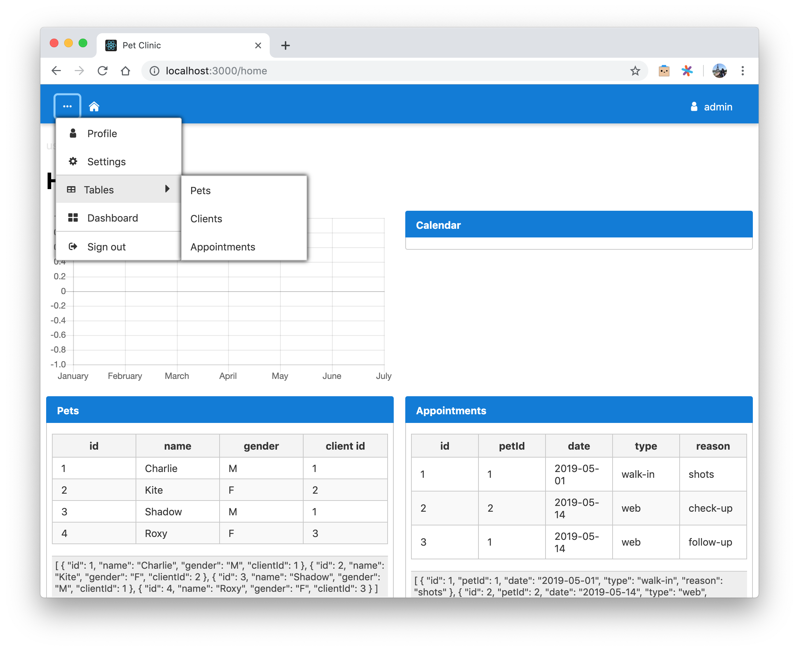
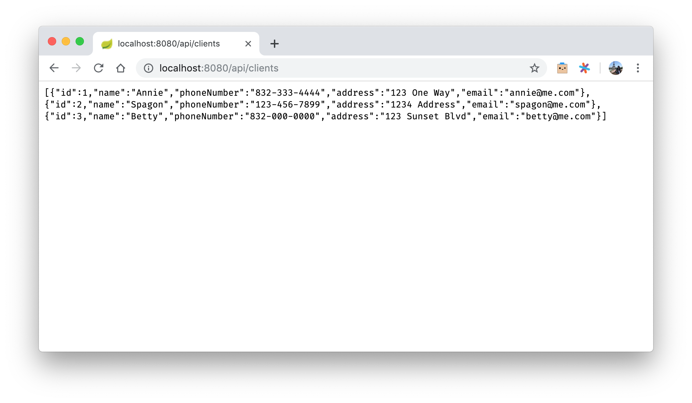

# spring web app using react

**server**: http://localhost:8080/
(`cd server` then run using `mvn spring-boot:run`)

**client**: http://localhost:3000/
(`cd client` then run using `npm start`)

---

**username**: admin
**password**: password

(refresh the home page after logging in)

---

current specs:

---

[spring-react-boilerplate](https://github.com/pugnascotia/spring-react-boilerplate): An example application that uses a Spring Java backend with a React frontend and can perform server-side rendering (SSR).

---

## API

-   http://localhost:8080/api/clients
-   http://localhost:8080/api/pets
-   http://localhost:8080/api/appointments

**/api/{table}/{id}**

-   http://localhost:8080/api/clients/1
-   http://localhost:8080/api/pets/1
-   http://localhost:8080/api/appointments/1

**/api/{table}/fields**
get column attribute names

-   http://localhost:8080/api/clients/fields
-   http://localhost:8080/api/pets/fields
-   http://localhost:8080/api/appointments/fields

**clients**

-   `/api/clients/name`: return id and name for all clients

**pets**

-   `/api/pets/client/{clientId}`: return pet list for client (1:n)
-   `/api/pets/client/info/{id}`: return client data for pet (1:1)

**appointments**

-   `/api/appointments/client/{clientId}`: return all appointments for client
-   `/api/appointments/client/info/{id}`: return client info for appointment

## helpful resources i came across during this project:

-   [How to build a Rest API with Spring Boot using MySQL and JPA](https://medium.freecodecamp.org/how-to-build-a-rest-api-with-spring-boot-using-mysql-and-jpa-f931e348734b)
-   [This is why we need to bind event handlers in Class Components in React](https://medium.freecodecamp.org/this-is-why-we-need-to-bind-event-handlers-in-class-components-in-react-f7ea1a6f93eb)
-   [Once Upon an Event Listener](https://developers.google.com/web/updates/2016/10/addeventlistener-once)
-   [How to Fix the Refresh Button When Using Service Workers](https://redfin.engineering/how-to-fix-the-refresh-button-when-using-service-workers-a8e27af6df68)
-   [Guide to hashCode() in Java](https://www.baeldung.com/java-hashcode)
-   [Http Client Basic Authentication](https://www.baeldung.com/httpclient-4-basic-authentication)
-   [axios: Promise based HTTP client for the browser and node.js](https://github.com/axios/axios)
-   [Creating Spring Boot and React CRUD Full Stack Application with Maven](https://www.springboottutorial.com/spring-boot-react-full-stack-crud-maven-application)
-   [How basic HTTP authentication and session works](https://medium.com/@bitshadow/how-basic-http-authentication-and-session-works-d29af9caec31)
-   [Spring REST Hello World Example](https://www.mkyong.com/spring-boot/spring-rest-hello-world-example/)
-   [How to fetch data in React](https://www.robinwieruch.de/react-fetching-data/)
-   [how to take advantage of local storage in your react projects](https://hackernoon.com/how-to-take-advantage-of-local-storage-in-your-react-projects-a895f2b2d3f2)
